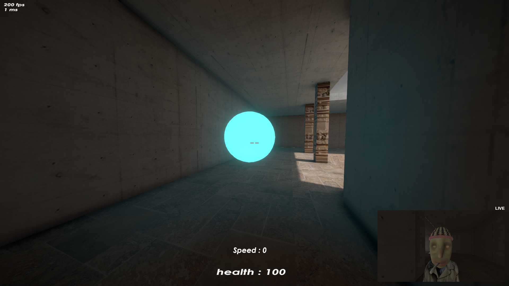
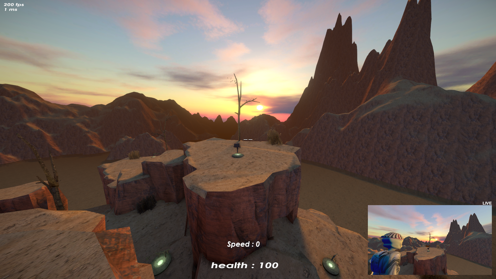

# selfcam

a straftat mod that shows your own character in a little corner cam while you play. you drop a camera in the world, it stays put and keeps looking at you, and you can rewind it up to 5 seconds to see how a movement looked.




## controls

- `o` - turn the cam on/off
- `p` - drop the camera at head height (a marker shows where it is)
- `l` - lock it in place, or let it follow you again
- `[` `]` - rewind delay, from live up to 5 seconds back
- `k` - save a screenshot to your pictures folder (full res when live)

fov and the keybinds can be changed in the config or the mod menu.

## fairness

it's practice only. it only runs in the tutorial and the exploration/sandbox maps, and it turns itself off in real matches so it can't be used as an advantage. it's read-only and doesn't touch anything other players see.

## install

use a mod manager like r2modman or thunderstore mod manager and it'll pull in bepinex on its own.

## building

needs the .net sdk and a local copy of straftat (it builds against the game's dlls). point it at your install by making `QuarterViewSelfCam/Directory.Build.local.props` (note: the filename and the xml tags are case-sensitive):

```xml
<Project><PropertyGroup>
  <GameDir>/path/to/steamapps/common/STRAFTAT/</GameDir>
</PropertyGroup></Project>
```

then:

```
dotnet build -c Release QuarterViewSelfCam/QuarterViewSelfCam.csproj   # builds + drops the dll into the game
./pack.sh                                                              # makes the thunderstore zip in dist/
```

the bepinex compile dlls are vendored in `libs/` so it builds without bepinex installed.
